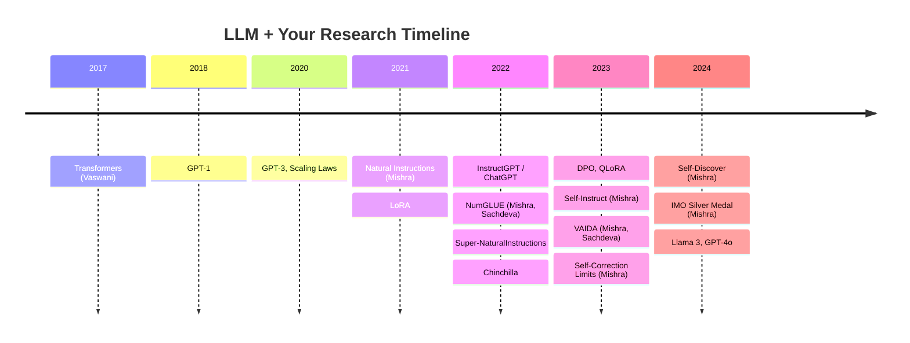

# Slide Creation Resources & Tools

## Purpose
A condensed guide to online tools and reusable visual resources for building slides from the deep-dive documents. Organized by task: making slides, creating diagrams, finding existing visuals, and generating charts.

---

## 1. Presentation Tools (Build the Deck)

| Tool | Best For | Free Tier | Export Options |
|------|----------|-----------|----------------|
| **[Google Slides](https://slides.google.com)** | Collaborative editing, simple layouts | Unlimited free | PPTX, PDF |
| **[Canva](https://www.canva.com)** | Polished designs, AI layout suggestions | Free (20 AI uses/mo) | PPTX, PDF, PNG |
| **[SlidesCarnival](https://www.slidescarnival.com)** | Free professional templates (AI/tech themed) | Fully free templates | Google Slides, PPTX |
| **[Napkin AI](https://www.napkin.ai)** | Text → diagram/infographic instantly | Free forever (500 credits/week) | PNG, SVG, PDF, PPTX |
| **[ChatSlide](https://www.chatslide.ai)** | Turn markdown/URL/PDF into slides | 100 free credits | PDF |
| **[SlidesAI.io](https://www.slidesai.io)** | Google Slides add-on, prompt-to-deck | 3 free presentations/mo | Google Slides native |

### Recommended Workflow
```
1. Use deep-dive docs → paste key points into Napkin AI → get diagrams
2. Pick a SlidesCarnival template (tech/AI themed) for consistent design
3. Import template into Google Slides
4. Drop Napkin AI exports + manually created diagrams into slides
5. Use Canva for final polish on individual visuals if needed
```

---

## 2. Diagram & Visual Creation Tools

| Tool | Best For | URL | Free? |
|------|----------|-----|-------|
| **[Excalidraw](https://excalidraw.com)** | Hand-drawn style diagrams, architecture flows | excalidraw.com | Yes, fully free |
| **[draw.io (diagrams.net)](https://app.diagrams.net)** | Professional architecture diagrams, flowcharts | app.diagrams.net | Yes, fully free |
| **[Napkin AI](https://www.napkin.ai)** | Paste text → generates diagram automatically | napkin.ai | Free tier (500/week) |
| **[Mermaid Live Editor](https://mermaid.live)** | Code-based diagrams (timelines, flowcharts) | mermaid.live | Yes, fully free |
| **[TLDraw](https://www.tldraw.com)** | Quick whiteboard sketches | tldraw.com | Yes, fully free |
| **[Python matplotlib/seaborn](https://matplotlib.org)** | Data charts, scaling curves, bar charts | Local | Yes |

### Which Tool for Which Diagram

| Diagram Type | Recommended Tool | Why |
|-------------|-----------------|-----|
| Transformer architecture | draw.io | Clean, professional, layered |
| Mystery novel analogy | Excalidraw | Hand-drawn feel, storytelling |
| Attention heatmaps | Python matplotlib | Data-driven, precise |
| Q/K/V flow | Excalidraw or Napkin AI | Conceptual, visual |
| Timeline (research) | Mermaid Live | Code → renders cleanly |
| LoRA mechanism | draw.io | Technical precision needed |
| Memory comparison bars | Python or Canva | Chart-based |
| Decision flowcharts | draw.io or Excalidraw | Flow logic |
| RLHF pipeline | draw.io | Multi-stage, structured |
| Before/after comparisons | Canva or PowerPoint | Layout flexibility |

---

## 3. Existing Visuals You Can Reuse (With Attribution)

### Transformer & Attention Diagrams

| Resource | URL | What You Get |
|----------|-----|-------------|
| **Jay Alammar — "The Illustrated Transformer"** | [jalammar.github.io/illustrated-transformer](https://jalammar.github.io/illustrated-transformer/) | Step-by-step attention visuals, encoder/decoder flow, Q/K/V diagrams |
| **Jay Alammar — "The Illustrated GPT-2"** | [jalammar.github.io/illustrated-gpt2](https://jalammar.github.io/illustrated-gpt2/) | Decoder-only architecture, token generation visuals |
| **3Blue1Brown — "Attention in Transformers"** | [3blue1brown.com/lessons/attention](https://www.3blue1brown.com/lessons/attention) | Animated Q/K/V intuition, embedding space visuals |
| **3Blue1Brown — "But what is a GPT?"** | [3blue1brown.com/lessons/gpt](https://www.3blue1brown.com/lessons/gpt/) | Token prediction, embeddings, full transformer visual |
| **Wikimedia Commons — Transformer Architecture SVG** | [commons.wikimedia.org](https://commons.wikimedia.org/wiki/File:Full_GPT_architecture.svg) | Free SVG of GPT architecture (CC-licensed) |
| **Wikimedia Commons — Full Transformer** | [commons.wikimedia.org](https://commons.wikimedia.org/wiki/File:Transformer,_full_architecture.png) | Original encoder-decoder diagram |
| **Deepgram — "Visualizing Transformers"** | [deepgram.com/learn/visualizing-and-explaining-transformer-models](https://deepgram.com/learn/visualizing-and-explaining-transformer-models-from-the-ground-up) | Clean architecture diagrams with explanations |
| **GitHub — Neural Network Architecture Diagrams** | [github.com/kennethleungty/Neural-Network-Architecture-Diagrams](https://github.com/kennethleungty/Neural-Network-Architecture-Diagrams) | Reusable NN architecture templates |
| **GitHub — LLM Transformer Visualization** | [github.com/evrenbaris/LLM-transformer-visualization](https://github.com/evrenbaris/LLM-transformer-visualization) | Interactive transformer visualizations |

### Scaling, LoRA, and Alignment Visuals

| Resource | URL | What You Get |
|----------|-----|-------------|
| **Original Papers (arXiv)** | Various (see deep-dive docs) | Canonical figures: LoRA Fig 1, InstructGPT Fig 2, Scaling Laws Fig 1 |
| **Lilian Weng — "The Transformer Family v2"** | [lilianweng.github.io/posts/2023-01-27-the-transformer-family-v2](https://lilianweng.github.io/posts/2023-01-27-the-transformer-family-v2/) | Comprehensive architecture comparison diagrams |
| **Chris Olah — "Deep Learning, NLP, and Representations"** | [colah.github.io/posts/2014-07-NLP-RNNs-Representations](https://colah.github.io/posts/2014-07-NLP-RNNs-Representations/) | Word embedding space visualizations |
| **Chip Huyen — "Reinforcement Learning from Human Feedback"** | [huyenchip.com/2023/05/02/rlhf](https://huyenchip.com/2023/05/02/rlhf) | RLHF pipeline diagrams |
| **HuggingFace — "Illustrating RLHF"** | [huggingface.co/blog/rlhf](https://huggingface.co/blog/rlhf/) | Clean RLHF stage diagrams |

### JEPA & Frontier

| Resource | URL | What You Get |
|----------|-----|-------------|
| **Meta AI Blog — V-JEPA** | [ai.meta.com/blog/v-jepa...](https://ai.meta.com/blog/v-jepa-yann-lecun-ai-model-video-joint-embedding-predictive-architecture/) | V-JEPA explanation with official visuals |
| **Rohit Bandaru — "Deep Dive into JEPA"** | [rohitbandaru.github.io/blog/JEPA-Deep-Dive](https://rohitbandaru.github.io/blog/JEPA-Deep-Dive/) | Accessible JEPA diagrams |

---

## 4. Slide Templates (Tech/AI/Research)

| Template | Source | Style |
|----------|--------|-------|
| [AI Neural Networks Conference](https://www.slidescarnival.com/template/artificial-neural-networks-conference/55520) | SlidesCarnival | Blue/purple gradient, futuristic |
| [AI Technology Thesis Defense](https://www.slidescarnival.com/template/cyber-futuristic-ai-technology-thesis-defense/55276) | SlidesCarnival | Dark, minimalist, tech |
| [Technology Thesis (Illustrative)](https://www.slidescarnival.com/template/illustrative-technology-thesis/21747) | SlidesCarnival | Bright blue, academic |
| Canva "AI Presentation" templates | Search canva.com | Various modern tech styles |

---

## 5. Quick-Reference: Diagram per Slide

### Section 1: Foundations

| Slide | Diagram Needed | Best Source/Tool |
|-------|---------------|-----------------|
| 3 (What is an LLM) | Mystery novel + probability bars | Excalidraw (custom) |
| 4 (Embeddings) | Word clusters in 2D/3D space | Python t-SNE + Chris Olah blog for reference |
| 5 (Attention Q/K/V) | Q/K/V flow with softmax | Jay Alammar "Illustrated Transformer" + Excalidraw custom |
| 6 (Multi-Head) | Parallel heads → concat | Vaswani et al. Fig 2 (from paper) |
| 7 (MLP) | Attention vs MLP roles | Excalidraw (custom two-panel) |
| 8 (Full Architecture) | Decoder-only transformer | Wikimedia SVG + annotate in draw.io |
| 9 (Why Transformers Won) | O(n²) curve + limitations | Python matplotlib |
| 10 (JEPA) | Autoregressive vs latent prediction | Meta AI Blog V-JEPA + Excalidraw custom |

### Section 2: Scaling

| Slide | Diagram Needed | Best Source/Tool |
|-------|---------------|-----------------|
| 11 (Pre-train + Fine-tune) | Two-phase pipeline | Excalidraw or draw.io |
| 12 (GPT-2 → GPT-3) | Parameter growth log-scale chart | Python matplotlib |
| 13 (Scaling Laws) | Log-log loss curves | Kaplan et al. Fig 1 (from paper) + Python recreation |
| 14 (Chinchilla) | Tokens-per-param comparison | Python bar chart |
| 14b (Instruction-Tuning) | NatInst → ChatGPT timeline | Mermaid or Excalidraw |

### Section 3: Alignment

| Slide | Diagram Needed | Best Source/Tool |
|-------|---------------|-----------------|
| 15 (Alignment Problem) | Aligned vs unaligned outputs | PowerPoint/Canva side-by-side |
| 16 (RLHF) | 3-stage pipeline | InstructGPT Fig 2 (paper) or HuggingFace blog |
| 17 (DPO) | RLHF vs DPO comparison | draw.io (two-column) |
| 18 (Limitations) | Self-correction failure chain | Excalidraw |

### Section 4: Fine-Tuning

| Slide | Diagram Needed | Best Source/Tool |
|-------|---------------|-----------------|
| 19 (Why Fine-Tune) | Spectrum from full FT to prompt | Excalidraw or Napkin AI |
| 20 (Problem) | Memory breakdown stacked bar | Python matplotlib |
| 21 (LoRA Insight) | Frozen W + BA path | LoRA paper Fig 1 + draw.io annotated |
| 22 (LoRA Details) | Multi-tenant deployment | Excalidraw |
| 23 (QLoRA) | Memory comparison chart | Python bar chart |
| 24 (LoRA Family) | Family tree | draw.io or Mermaid |

---

## 6. Workflow Shortcuts

### Fastest Path: Text → Visual Slide

```
1. Copy a bullet-point section from deep-dive doc
2. Paste into Napkin AI (napkin.ai)
3. Select generated visual style
4. Export as PNG/SVG
5. Drop into Google Slides template
```

### For Technical Architecture Diagrams

```
1. Open draw.io (app.diagrams.net)
2. Use "Software" shape library
3. Build transformer blocks: rectangles + arrows
4. Export as SVG (scales cleanly)
5. Import into slides
```

### For Data Charts (Scaling, Memory, Performance)

```python
# Quick Python template for all charts
import matplotlib.pyplot as plt
import numpy as np

# Example: Parameter growth
models = ['GPT-1', 'GPT-2', 'GPT-3', 'GPT-4', 'Llama 3']
params = [0.117, 1.5, 175, 1800, 405]  # billions

plt.figure(figsize=(10, 6))
plt.bar(models, params, color=['#4CAF50', '#2196F3', '#FF9800', '#F44336', '#9C27B0'])
plt.yscale('log')
plt.ylabel('Parameters (Billions, log scale)')
plt.title('LLM Parameter Growth')
plt.savefig('param_growth.png', dpi=150, bbox_inches='tight')
```

### For Timeline Diagrams (Mermaid)



---

## 7. Attribution Template

For every external visual used in slides:

```
Small text in slide footer or notes:
"Source: [Author], [Title], [Year]. [URL or arXiv ID]"

Example:
"Source: Vaswani et al., 'Attention Is All You Need,' 2017. arXiv:1706.03762, Fig 1"
"Source: Jay Alammar, 'The Illustrated Transformer,' 2018. jalammar.github.io"
"Diagram: Created with Excalidraw"
```

---

*Created: July 2, 2026*
